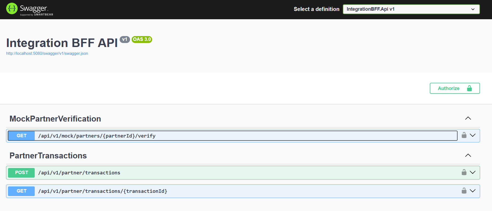

# Integration BFF

Integration BFF is a .NET 8 Web API that accepts partner transactions, validates and verifies the partner, stores the accepted transaction in MySQL, and reliably publishes it to Kafka through a transactional outbox.

## Running application

The Swagger UI below confirms that the containerized API is running successfully and exposes the partner verification and transaction endpoints.



## Architecture

The solution follows an style layered structure with inward dependencies:

- `IntegrationBFF.Core`: shared application exceptions.
- `IntegrationBFF.Domain`: transaction and outbox domain models.
- `IntegrationBFF.Application`: CQRS commands and queries, validation, ports, and retry orchestration.
- `IntegrationBFF.Infrastructure`: MySQL/EF Core, partner HTTP client, Kafka producer, and outbox worker.
- `IntegrationBFF.Api`: controllers, JWT authorization, OpenAPI, health check, mock verification endpoint, and global exception handling.

The POST path is:

```text
HTTP request -> validation -> partner verification with retries
             -> MySQL transaction + outbox row -> 202 Accepted
             -> background outbox worker -> Kafka -> Published status
```

The unique `(partnerId, transactionReference)` index and duplicate lookup make repeated submissions idempotent. Persisting the business record and outbox message in the same database commit prevents a successful response from losing its Kafka message.

## Run with Docker

Requirements: Docker Desktop with Compose.

```powershell
docker compose up --build
```

This starts:

- API and Swagger: `http://localhost:5080/swagger`
- MySQL: `localhost:3306`
- Kafka: `localhost:9092`
- Health check: `http://localhost:5080/health`

Database migrations are applied automatically when the API starts.

Create a local JWT or you can copy body to postman and run.

```powershell
$token = ./scripts/Get-DevJwt.ps1
```

Submit a transaction:

```powershell
$body = @{
  partnerId = "P-1001"
  transactionReference = "TXN-99823"
  amount = 250.00
  currency = "USD"
  timestamp = "2024-05-10T14:30:00Z"
} | ConvertTo-Json

Invoke-RestMethod `
  -Method Post `
  -Uri http://localhost:5080/api/v1/partner/transactions `
  -Headers @{ Authorization = "Bearer $token" } `
  -ContentType application/json `
  -Body $body
```

Partner IDs beginning with `P-` are considered valid. The mock verification endpoint throws a simulated timeout on about 30% of calls; the application retries transient failures up to three times with exponential backoff.

Stop and remove local containers:

```powershell
docker compose down
```

Add `-v` only when you also want to delete the local MySQL and Kafka volumes.

## Run without Docker

Install the .NET 8 SDK, run MySQL and Kafka, then update `appsettings.Development.json` or environment variables for the connection string and broker address.

```powershell
dotnet restore
dotnet run --project src/IntegrationBFF.Api
```

## Tests and coverage

The NUnit suites cover payload validation, transient retry and retry exhaustion, CQRS handler behavior, controller mapping, health, and JWT enforcement.

```powershell
dotnet test IntegrationBFF.sln --configuration Release
dotnet test IntegrationBFF.sln --configuration Release `
  --collect:"XPlat Code Coverage" `
  --results-directory TestResults
```

## API behavior

- `POST /api/v1/partner/transactions` requires the `partner.transactions.write` scope and returns `202 Accepted`.
- `GET /api/v1/partner/transactions/{transactionId}` requires the `partner.transactions.read` scope.
- `GET /api/v1/mock/partners/{partnerId}/verify` is the local verification mock.
- Errors use RFC 7807 problem details with a stable `code`, `traceId`, and validation error dictionary.

For production, replace the development signing key with a secret manager value, use an external identity provider and asymmetric token signing, terminate TLS at the ingress, restrict the mock endpoint to development, use Kafka and MySQL credentials from secrets, and add rate limiting plus partner-specific authorization.
